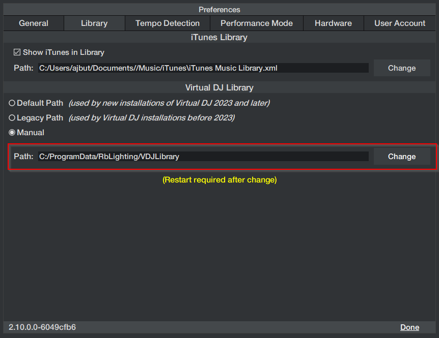
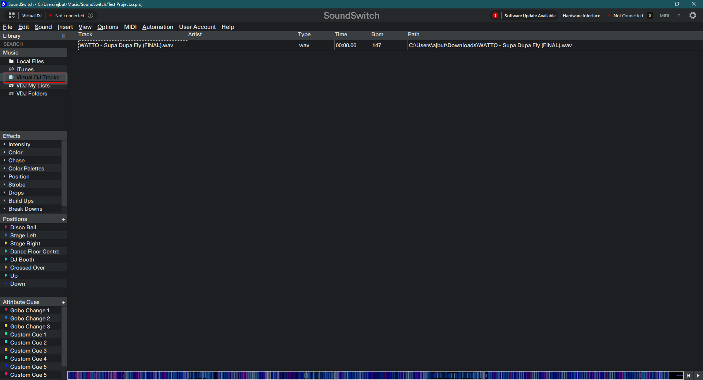
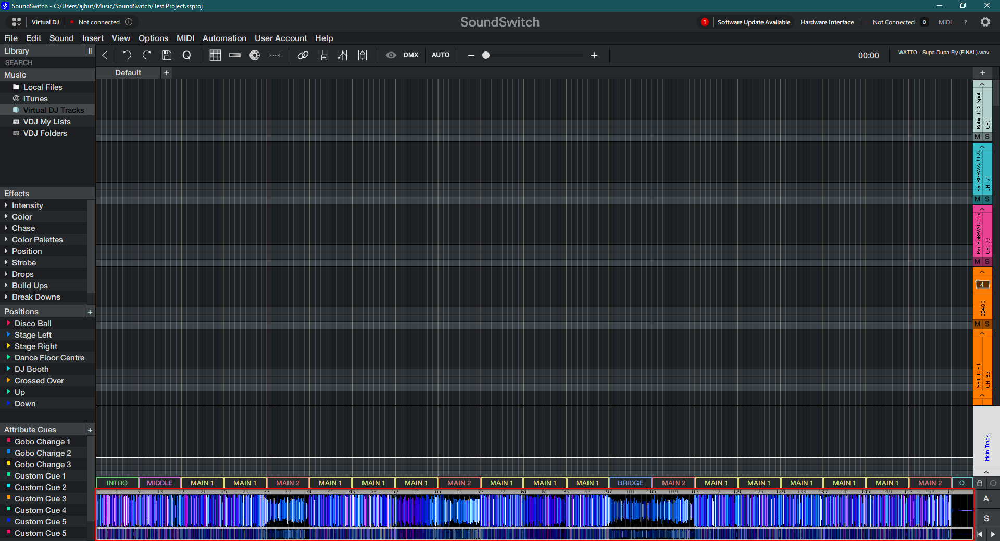

This guide outlines how to create Rekordbox tracks with scripted lighting (ie. pre-programmed lighting sequences).

## Export library

You must export your Rekordbox library using RbLighting to a format that SoundSwitch understands.

---

Follow the steps below:

1. Open RbLighting and open "Settings":

2. Click "Export Library" under the "Library Export" heading:
    * This will create a VirtualDJ database file in `C:\ProgramData\RbLighting\VDJLibrary`.
    
        This is the library we will point SoundSwitch.

## Configure SoundSwitch

You can now configure SoundSwitch to use the library that we just exported.

---

1. Open SoundSwitch and browse to the "Settings".

2. Change the "Virtual DJ Library" option to "Manual", and then change the folder path to `C:\ProgramData\RbLighting\VDJLibrary`:

3. Restart SoundSwitch

## Result

You can now see your Rekordbox tracks in "Virtual DJ Tracks" in SoundSwitch:

Browsing into a song will show you that the Rekordbox beatgrid has been applied to SoundSwitch:

---

From here, you can now script your tracks and they will automatically play in sync with Rekordbox.