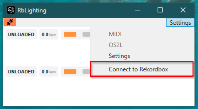

## RbLighting won't connect to Rekordbox!

### Symptoms

You're seeing the orange connection icon in RbLighting.

### Resolution

1. In RbLighting, try to force a connection to Rekordbox.
    * "Settings" -> "Connect to Rekordbox".
2. Wait 1-2 minutes.
    * If RbLighting does not connect, proceed to the next step.
3. Confirm you are using a supported version of Rekordbox.
    * Consult the table in [supported versions](/docs/supported-versions) to confirm.
3. Open "Services" on your PC, and locate the "RbLighting" service.
    * Confirm that it is "running". If not, right click and click "Start".
    * If RbLighting does not connect or the service abruptly stops, proceed to the next step.
4. Consult the service log file.
    * This is located in `C:\ProgramData\RbLighting\service.log`.
5. For any further support, please contact [rblighting@albiedj.com](mailto:rblighting@albiedj.com) and attach the log file.