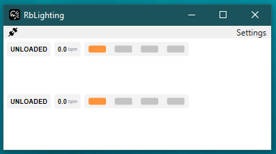
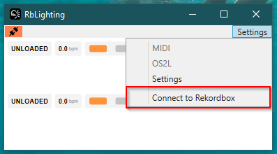
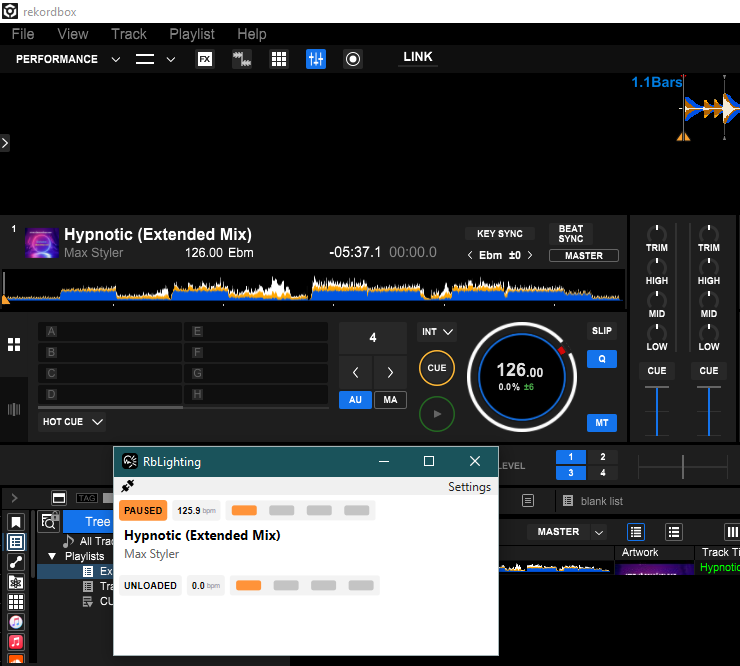
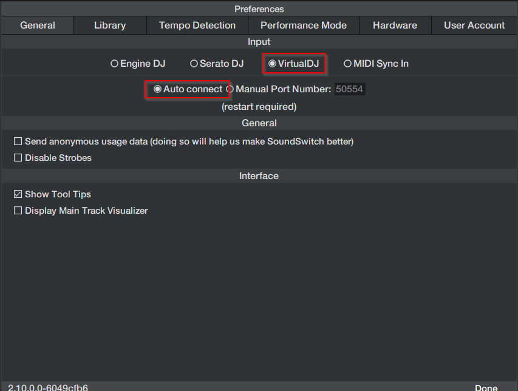
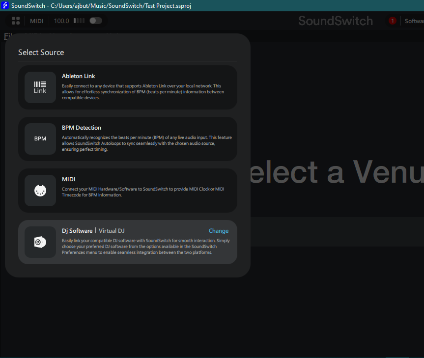
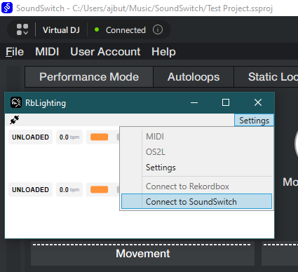

A quick guide to get SoundSwitch linked to Rekordbox, using the RbLighting tool.

## What is RbLighting?

RbLighting is a small utility that bridges Rekordbox and SoundSwitch so your lighting can follow your music in real time. It reads timing from Rekordbox (BPM, beat phase, downbeat, bar) and publishes it in a format SoundSwitch can utilise.

## Installation

Download the latest MSI installer of RbLighting from [here](https://rblighting.albiedj.com).

Run the MSI installer. There is currently no installer UI, you will see the Windows Installer window briefly before it finishes installing.

## First Run

The next steps will guide you through running RbLighting for the first time.

### Rekordbox Setup

Once installed, make sure Rekordbox is open, then open the RbLighting application from the start menu.

If Rekordbox has successfully connected, you will be greeted with a screen that looks like below:

---

If you see an orange connection icon the top left, you may need to click "Settings" -> "Connect to Rekordbox".
The icon will go black once it has successfully connected to Rekordbox.

---

Try to load a song in Rekordbox and you should see the song name, BPM and play status appear in the RbLighting window.

If you do not see updates in RbLighting, please consult the [troubleshooting steps](/docs/troubleshooting)

### SoundSwitch Setup

Open SoundSwitch and open the settings page.

Under "General", choose "VirtualDJ" as the input.

Leave the connection mode on "Auto Connect" (see [known limitations](/docs/known-limitations) for more information).

Restart SoundSwitch.

---

Once restarted, enter "Perform" mode and change the source to VirtualDJ:

RbLighting will periodically auto-connect to SoundSwitch and you should see "Connected" in SoundSwitch after a short time.

If you do not, click "Settings" -> "Connect to SoundSwitch" within RbLighting to force a reconnection.

