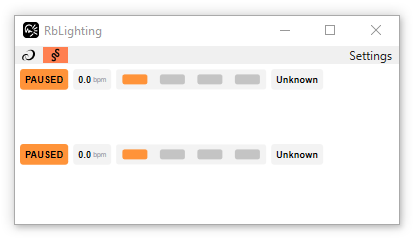
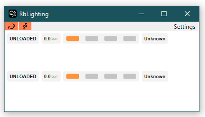
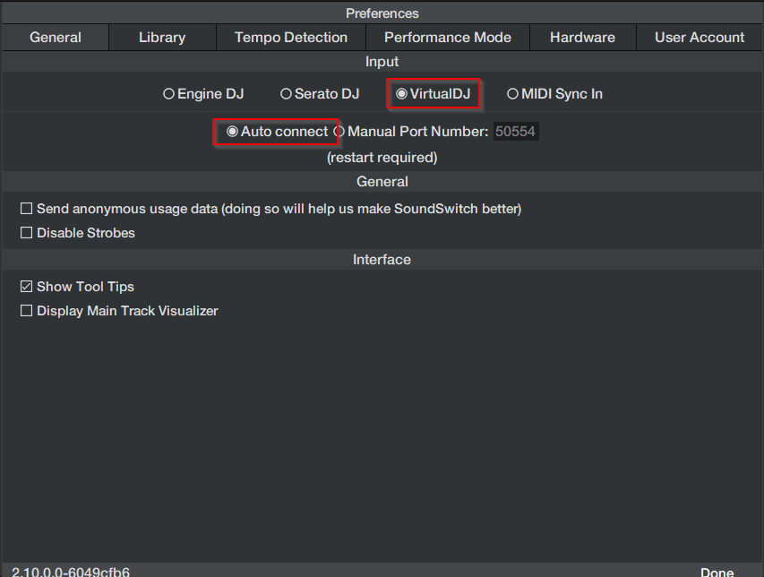
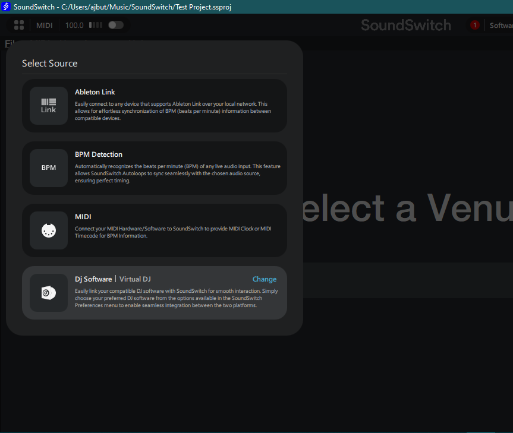

**Sync your Rekordbox DJ sets with SoundSwitch lighting in real-time**

Welcome! This guide will help you set up RbLighting so your lighting follows your music seamlessly. You'll be up and running in about 10 minutes.

---

## What You'll Need

Before starting, make sure you have:

- **Windows PC** (RbLighting currently supports Windows only)
- **Rekordbox** installed
- **SoundSwitch** installed
- **Administrator access** to install software

---

## What is RbLighting?

RbLighting is a lightweight bridge application that connects Rekordbox and SoundSwitch. It captures real-time timing data from Rekordbox (BPM, beat phase, downbeats, and bars) and transmits it to SoundSwitch, enabling your lighting to stay perfectly synchronized with your music.

**How it works:**
```
Rekordbox → RbLighting → SoundSwitch → Your Lighting
```

> **Note:** This is the first public release. While most users experience smooth operation, some configurations may require troubleshooting. Check the [troubleshooting guide](/docs/troubleshooting) if you encounter issues.


---

## Installation

### Step 1: Download RbLighting

1. Download the latest MSI installer from the [downloads page](/docs/download)
2. Save the file to your computer

### Step 2: Install RbLighting

1. **Double-click** the downloaded MSI file
2. The Windows Installer will run briefly (you may see it flash on screen)
3. Installation completes automatically—no configuration needed

> **Technical Note:** The installer runs silently without a UI. If you don't see any errors, the installation was successful.

---

## Setup Guide

### Part 1: Connect to Rekordbox

#### 1. Launch Rekordbox
Make sure Rekordbox is **open and running** before proceeding.

#### 2. Start RbLighting
- Open the **Start Menu**
- Search for **"RbLighting"**
- Click to launch the application

#### 3. Verify Connection
When RbLighting opens, you should see the main screen.


> **Note:** Please wait 20-30 seconds to allow RbLighting to connect.

**Successful Connection to Rekordbox:**
- A **black AlphaTheta icon** in the top-left corner
- The application window showing placeholders for track information



**Connection Failed (Orange Icon):**
If you see an **orange AlphaTheta icon** instead:
1. Click **"Settings"** in the menu
2. Select **"Connect to Rekordbox"**
3. Wait a moment—the icon should turn **black**



#### 4. Test the Connection
1. Load any track in Rekordbox
2. Press **Play**
3. Watch the RbLighting window for updates:
   - **Song name** should appear
   - **BPM** should display
   - **Play status** should change

✅ **Success!** If you see these updates, Rekordbox is connected properly.

❌ **Not Working?** See the [troubleshooting guide](/docs/troubleshooting) for solutions.

---

### Part 2: Connect to SoundSwitch

#### 1. Open SoundSwitch Settings
1. Launch **SoundSwitch**
2. Click the **Settings** icon or menu

#### 2. Configure Input Source
1. Navigate to the **"General"** tab
2. Find the **"Input"** or **"DJ Software"** dropdown
3. Select **"VirtualDJ"** from the list

> **Why VirtualDJ?** RbLighting communicates using VirtualDJ's protocol, which SoundSwitch supports.

#### 3. Set Connection Mode
- Keep **"Auto Connect"** enabled (recommended)

> **Note:** For known limitations with connection modes, see the [known limitations page](/docs/known-limitations).



#### 4. Restart SoundSwitch
Close and reopen SoundSwitch to apply the changes.

#### 5. Switch to Perform Mode
1. In SoundSwitch, enter **"Perform"** mode
2. Change the source to **"VirtualDJ"**



#### 6. Verify Connection
- RbLighting automatically attempts to connect to SoundSwitch every few seconds
- Look for **"Connected"** status in SoundSwitch (usually appears within 5-10 seconds)

**Manual Connection:**
If the connection doesn't establish automatically:
1. In RbLighting, click **"Settings"**
2. Select **"Connect to SoundSwitch"**
3. Wait for the connection status to update

---

## You're All Set!

Your lighting system is now synchronized with Rekordbox through RbLighting. Here's what happens now:

- When you play a track in Rekordbox, SoundSwitch receives real-time timing data
- Your lighting cues will trigger in perfect sync with beats.
- Changes in BPM are tracked automatically

---

## Quick Troubleshooting

### RbLighting won't connect to Rekordbox
- Ensure Rekordbox is running **before** starting RbLighting
- Try restarting both applications
- Check that you're using a compatible version of Rekordbox

### SoundSwitch shows "Disconnected"
- Verify you selected **"VirtualDJ"** as the input source
- Click **"Connect to SoundSwitch"** in RbLighting's Settings menu
- Restart SoundSwitch if the issue persists

### Lighting is out of sync
- Confirm the track is analyzed in Rekordbox (beat grid set)
- Check that the BPM reading in RbLighting matches your track
- Verify SoundSwitch shows "Connected" status

For detailed troubleshooting, visit the [troubleshooting page](/docs/troubleshooting).

---

## Workflow Tips

**Best Practice Setup:**
1. Start **Rekordbox** first
2. Launch **RbLighting** second
3. Open **SoundSwitch** last
4. Wait for both connections to establish before performing

**During Your Set:**
- Keep RbLighting running in the background
- The connection should maintain automatically
- If you notice sync issues, check RbLighting's connection icons

---

## Need More Help?

- [Troubleshooting Guide](/docs/troubleshooting)
- [Known Limitations](/docs/known-limitations)
